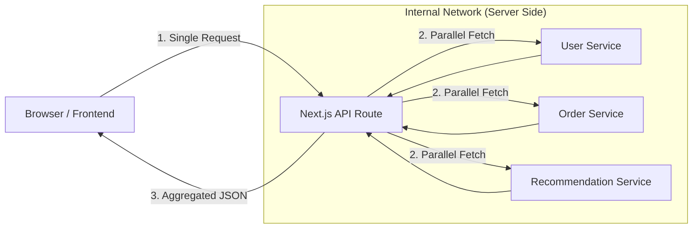
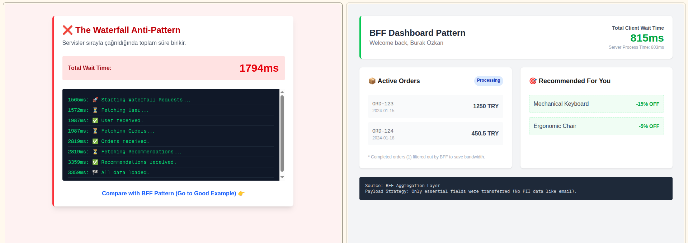

# Next.js BFF (Backend for Frontend) Aggregation Pattern

 

### 🎯 Project Overview
This repository demonstrates the implementation of the **Backend for Frontend (BFF)** pattern using Next.js App Router (Route Handlers).

It addresses common challenges in modern microservices architectures, such as **Client-Side Waterfalls**, **Over-fetching**, and **exposed API endpoints**, by introducing a dedicated aggregation layer.

---

### 🏗️ The Architectural Problem
In a typical distributed system, a Frontend application (Dashboard) often needs to fetch data from multiple independent services (User, Orders, Recommendations).

**❌ Without BFF (Client-Side Fetching):**
1.  **Latency:** The browser makes 3 separate HTTP requests (Waterfall effect).
2.  **Over-fetching:** Services return huge JSON objects, but the UI only needs 10% of that data.
3.  **Security Risk:** API endpoints and potentially sensitive logic are exposed to the client.

---

### ✅ The Solution: Aggregation Layer
This project implements a **Next.js Route Handler** as a BFF layer that:
1.  **Aggregates:** Fetches data from multiple upstream services in parallel (Server-Side).
2.  **Transforms:** Filters and shapes the data (DTO Mapping) before sending it to the client.
3.  **Optimizes:** Reduces the payload size and establishes a single connection point for the Frontend.

#### Architecture Diagram

###  🛠️ Tech Stack
Framework: Next.js 14 (App Router)

Language: TypeScript

Pattern: BFF (Backend for Frontend) / API Gateway

Styling: Tailwind CSS (for the demo Dashboard)

Simulation: Mock Service Layer (to simulate latency and microservice behavior)

### 🚀 Getting Started
Clone the repository:

git clone [https://github.com/ozzkan-burak/nextjs-bff-aggregation-pattern.git](https://github.com/ozzkan-burak/nextjs-bff-aggregation-pattern.git)

Install dependencies:

npm install
# or
pnpm install
Run the laboratory:

npm run dev
Explore the difference:

Visit /dashboard/client to see the "Waterfall" approach.

Visit /dashboard/bff to see the "Aggregated" approach.

This project is a Proof of Concept (POC) for scalable frontend architectures.

### 📊 Benchmark Results (The Proof)

I conducted a side-by-side comparison simulating high network latency (User: 300ms, Orders: 800ms, Recs: 500ms).

| Metric | ❌ Direct Fetch (Waterfall) | ✅ BFF Pattern (Aggregated) | 🚀 Improvement |
| :--- | :--- | :--- | :--- |
| **Total Wait Time** | **~1794 ms** | **~817 ms** | **2.2x Faster** |
| **Requests** | 3 Round-trips | 1 Round-trip | Less Overhead |
| **Payload Size** | Full JSON | Filtered JSON | Bandwidth Saver |

#### Visual Evidence
> *Screenshot from the laboratory demo showing the exact timing difference.*

 
*(Note: Replace `docs/benchmark-proof.png` with the actual path to your uploaded image)*
